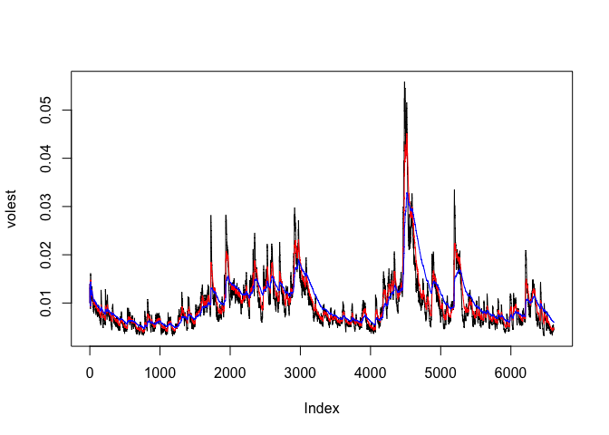

SP500
================

Set up environment
------------------

``` r
library(tseries)
```

Download the data.
------------------

``` r
SNPdata <- get.hist.quote("^gspc",quote="Close")
```

    ## time series ends   2017-03-31

Calculate log returns.
----------------------

The subtractration of log(lag(SNPdata)) and log(SNPdata)

``` r
SNPret <- log(lag(SNPdata)) - log(SNPdata)
```

Calculate volatility measure.
-----------------------------

Multiply the standard deviation of the data by the square root of 250 and multiply by 100.

``` r
SNPvol <- sd(SNPret) * sqrt(250) * 100
```

Calculate volatility over entire length of series for various three different decay factors.
--------------------------------------------------------------------------------------------

1.  10
2.  30
3.  100

``` r
## Define getVol function for volatility
getVol <- function(d, logrets) {
    var = 0
    lam = 0
    varlist <- c()

    for (r in logrets) {
        lam = lam*(1 - 1/d) + 1
      var = (1 - 1/lam)*var + (1/lam)*r^2
        varlist <- c(varlist, var)
    }

    sqrt(varlist)
}

volest  <- getVol(10,SNPret)
volest2 <- getVol(30,SNPret)
volest3 <- getVol(100,SNPret)
```

Plot the results
----------------

``` r
plot(volest,type="l")
lines(volest2, type="l", col="red")
lines(volest3, type="l", col="blue")
```


